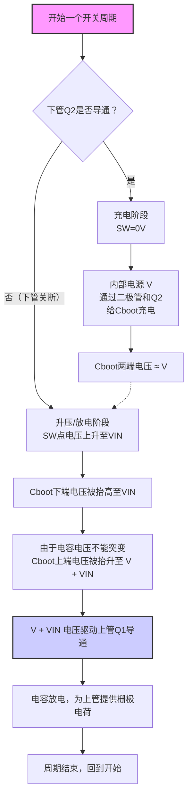

自举升压电容工作原理

自举升压电容的核心工作原理，可以概括为**利用电容两端电压不能突变的特性，通过将电容的参考地电位“举”起来，从而产生一个高于电源电压的驱动电压**。

这个电路主要用来驱动**半桥结构中的上管（通常是 N 沟道 MOSFET）**。要理解它的工作，需要先明白一个驱动难点：

### 为什么需要“自举”？

在一个典型的同步降压转换器（BUCK）电路中，有上下两个 N-MOS 管。

- **下管**的源极（S 极）直接接地，只要栅极（G 极）电压高于其导通阈值（Vgs(th)），就能轻松导通。
- **上管**的源极（S 极）连接在开关节点（SW）上，其电压会随着电路工作变化。当上管导通时，源极电压接近输入电压（VIN）。这时，如果要让上管也导通，其栅极电压就必须**比源极电压还要高出一个 Vgs(th)**，也就是需要高于输入电压。这在电路中直接提供是很困难的。

### 自举升压的工作过程

自举电路通过一个电容（Cboot）和一个二极管巧妙地解决了这个问题。它在一个开关周期内分为两个阶段工作：

1.  **充电阶段（下管导通时）**

    - 当下管 Q2 导通时，开关节点 SW 的电压被拉到**0V**（接地）。
    - 此时，内部一个低压电源（通常是 LDO）通过二极管，经过自举电容 Cboot，再通过下管 Q2 构成回路。电源给 Cboot 充电，使其两端电压**约为 V（这个 V 是内部 LDO 的电压，通常等于或略低于芯片的 VCC）**。此时电容上端 A 点的电压为 V。

2.  **升压/放电阶段（下管关断，上管导通时）**
    - 当下管 Q2 关断，需要上管 Q1 导通时，SW 点的电压会从 0V 迅速上升到接近输入电压 VIN。
    - 由于电容两端电压不能突变，当 Cboot 的下端（SW 点）从 0V 被抬升到 VIN 时，电容上端 A 点的电压也会被同步“举”起来，变为**V + VIN**。
    - 这个升高的电压（V + VIN）被用于驱动上管 Q1 的栅极。此时，栅极电压比源极电压（VIN）高出了 V，确保了上管可以稳定、低阻抗地导通。

下图可以清晰地展示这个“电压抬升”的过程：

> 实测波形也印证了这个过程：电容两端的电压（V）始终保持稳定，而它两端对地的电压则会随着 SW 点的电压一起被“举”高和拉低。

### 实际应用要点

在设计自举电路时，有几点值得留意：

- **电容选择**：自举电容的容值需要根据上管所需的栅极电荷（Qg）和允许的电压纹波来计算。**容值过小**会导致上管驱动电压不足而异常关断；**容值过大**则可能导致启动时充电时间过长，上管无法立刻响应。TI（德州仪器）的文档中给出了一个计算最小容值的参考公式：`CBoot = QTotal / ΔVVDDA`，其中 QTotal 是总所需电荷，ΔVVDDA 是允许的电压纹波。
- **布局**：为了降低寄生电感的影响，自举电容应**尽可能靠近驱动 IC 的对应引脚（VB 和 VS 或类似引脚）放置**。

如果对具体的容值计算或型号选择有更多疑问，可以随时再问我。
